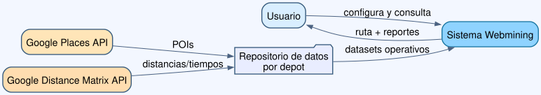
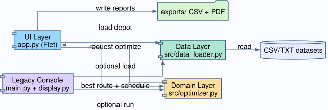
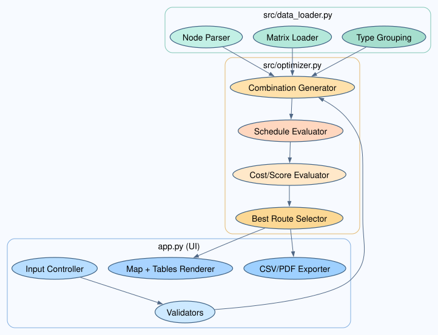
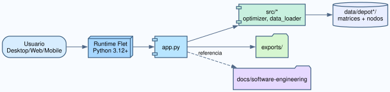
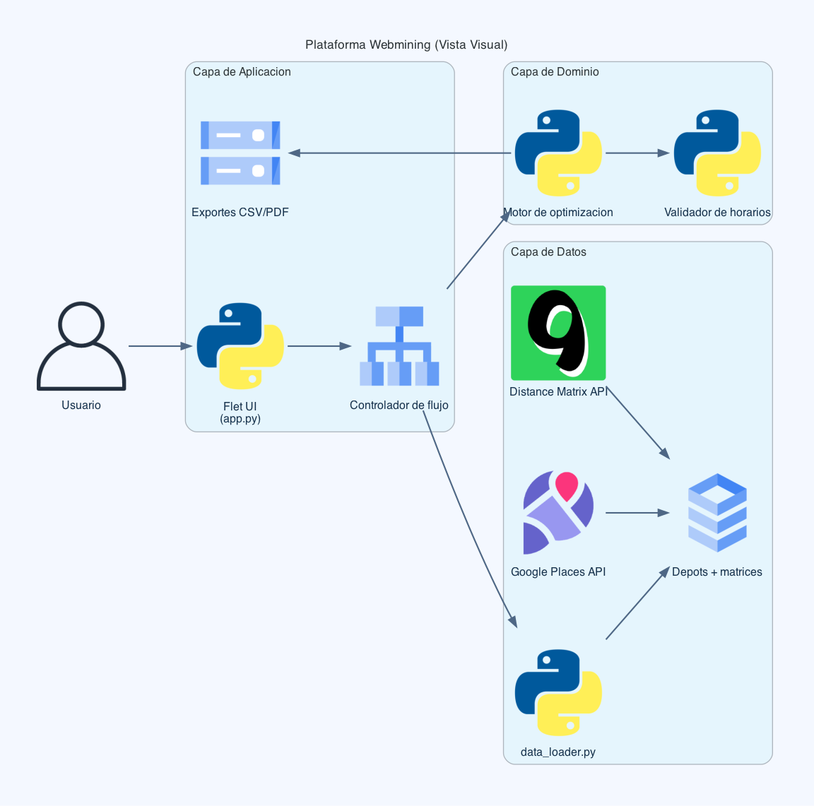

# 03 - Arquitectura

## Vista de contexto

El sistema Webmining se ejecuta como aplicacion Python/Flet y consume datasets locales preparados a partir de datos geograficos y de tiempos de viaje.

Sistemas externos relevantes:

- Google Places API: puntos de interes.
- Google Distance Matrix API: distancias y tiempos estimados.

## Vista de contenedores

- Contenedor UI: app.py (Flet, orquestacion de pantalla y eventos).
- Contenedor de dominio: src/optimizer.py (motor de optimizacion).
- Contenedor de datos: src/data_loader.py (lectura y normalizacion).
- Contenedor de presentacion legacy: main.py y src/display.py.
- Contenedor documental: docs/software-engineering.

## Vista de componentes

Componentes en app.py:

- Configuracion de inputs (depot, criterio, horarios, tipos).
- Validadores de entrada.
- Controlador de optimizacion.
- Render de mapa de ruta.
- Exportes CSV/PDF.

Componentes en optimizer.py:

- Evaluador de costo de ruta.
- Calculador de schedule (ventanas horarias).
- Busqueda por combinaciones.
- Selector de mejor solucion por criterio.

Componentes en data_loader.py:

- Parser de nodos y horarios.
- Cargador de matrices.
- Descubrimiento de depots.
- Agrupador por tipo de nodo.

## Decisiones arquitectonicas

- Arquitectura modular por responsabilidad.
- Persistencia local basada en archivos tabulares.
- UI orientada a eventos.
- Pipeline de datos desacoplado de la optimizacion.

## Riesgos arquitectonicos

- Escalabilidad del enfoque por combinaciones.
- Dependencia de calidad del dato externo.
- Dependencia de conectividad para enriquecimiento con Google.

## Estrategias de mitigacion

- Poda y heuristicas para combinaciones.
- Validaciones de consistencia de datos.
- Cache local de respuestas API.

