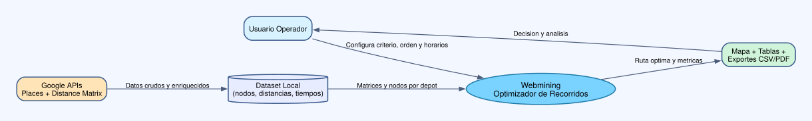
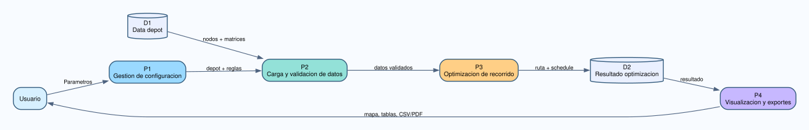
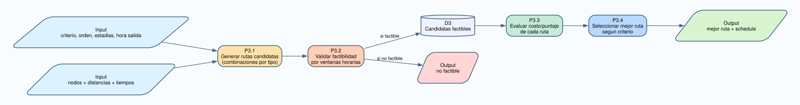

# 04 - DFD Nivel 0 a Nivel 2

## DFD Nivel 0 (Contexto)

Representa el sistema como una unica caja:

- Entradas: parametros de recorrido y datasets.
- Salidas: ruta, metricas, reportes.
- Entidades externas: usuario y Google APIs.

Diagrama: [diagrams/dfd_level_0.svg](diagrams/dfd_level_0.svg)

## DFD Nivel 1 (Descomposicion principal)

Procesos:

- P1: Gestion de configuracion.
- P2: Carga/validacion de datos.
- P3: Optimizacion de recorrido.
- P4: Visualizacion y exportes.

Almacenes de datos:

- D1: Dataset por depot.
- D2: Resultados de optimizacion.

Diagrama: [diagrams/dfd_level_1.svg](diagrams/dfd_level_1.svg)

## DFD Nivel 2 (Detalle del proceso de optimizacion)

Subprocesos de P3:

- P3.1 Construccion de candidatos.
- P3.2 Evaluacion de factibilidad horaria.
- P3.3 Calculo de score/costo.
- P3.4 Seleccion de mejor ruta.

Diagrama: [diagrams/dfd_level_2_optimizacion.svg](diagrams/dfd_level_2_optimizacion.svg)

## Trazabilidad DFD -> Codigo

- P1: app.py (inputs y validaciones).
- P2: src/data_loader.py.
- P3: src/optimizer.py.
- P4: app.py + export_pdf_report.
