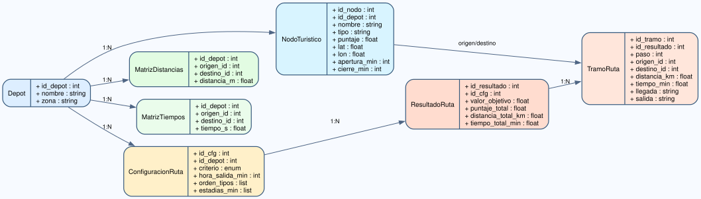

# 05 - Modelo de Datos y DER

## Entidades principales

- Depot: punto de inicio y regreso.
- NodoTuristico: lugar visitable con tipo, puntaje y horario.
- MatrizDistancias: costo espacial entre pares de nodos.
- MatrizTiempos: costo temporal entre pares de nodos.
- ConfiguracionRuta: criterio, orden y tiempos de estadia.
- ResultadoRuta: ruta final, metricas y schedule.
- TramoRuta: detalle entre nodo origen y destino.

## Relaciones

- Un Depot contiene muchos NodoTuristico.
- Un ResultadoRuta pertenece a una ConfiguracionRuta.
- Un ResultadoRuta contiene muchos TramoRuta.
- Matrices referencian IDs de NodoTuristico.

## DER

Diagrama: [diagrams/der_webmining.svg](diagrams/der_webmining.svg)

## Diccionario de datos resumido

- NodoTuristico.ID: entero, PK logica.
- NodoTuristico.tipo: string categorial.
- NodoTuristico.puntaje: float.
- NodoTuristico.apertura_min/cierre_min: entero en minutos.
- TramoRuta.distancia_km: float.
- TramoRuta.tiempo_min: float.
