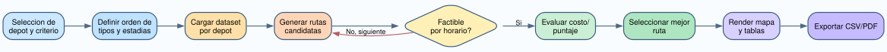
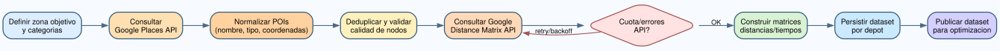

# 06 - Flujos y Procesos

## Flujo funcional de optimizacion

1. Usuario selecciona depot y criterio.
2. Usuario define orden de actividades y estadia.
3. Sistema carga dataset del depot.
4. Motor genera rutas candidatas.
5. Motor valida ventanas horarias.
6. Motor evalua criterio y selecciona mejor ruta.
7. UI renderiza mapa, tablas y metricas.
8. Usuario exporta CSV/PDF.

Diagrama: [diagrams/flow_optimizacion.svg](diagrams/flow_optimizacion.svg)

## Flujo de obtencion de datos Google (enfasis)

1. Definir bounding area y categorias objetivo.
2. Consultar Places API por categoria.
3. Normalizar nombres, coordenadas y tipos.
4. Resolver duplicados y calidad de datos.
5. Consultar Distance Matrix API para pares de nodos.
6. Construir matrices de distancias y tiempos.
7. Guardar dataset en archivos por depot.
8. Validar consistencia y versionar dataset.

Diagrama: [diagrams/flow_google_data_pipeline.svg](diagrams/flow_google_data_pipeline.svg)

## Riesgos del pipeline Google

- Limites de cuota y costo por request.
- Inconsistencias por cambios de Place ID.
- Latencia variable y errores transitorios.
- Diferencias de granularidad entre APIs.

## Controles recomendados

- Cache de respuestas y retry exponencial.
- Backoff ante rate limiting.
- Logs por lote de consulta.
- Versionado de snapshots de dataset.
