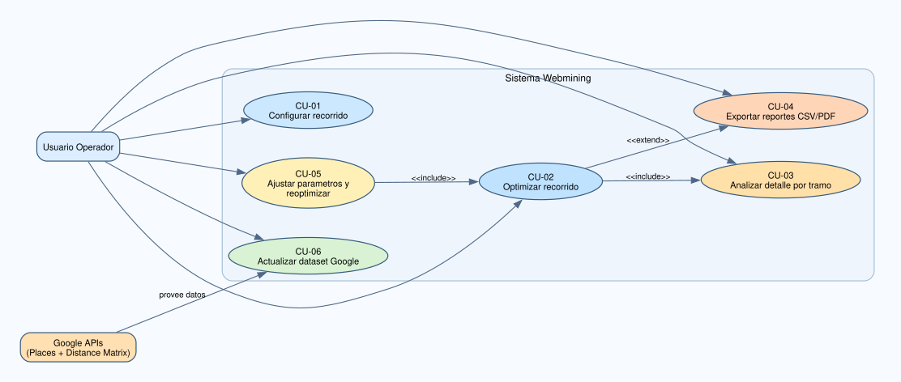
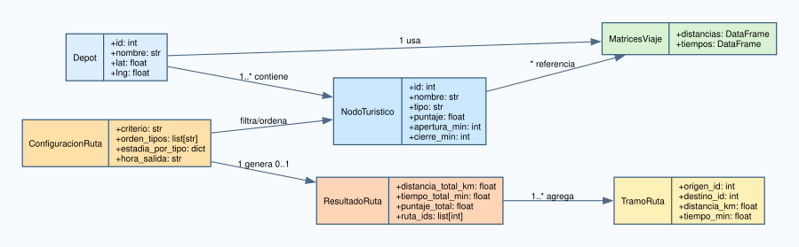
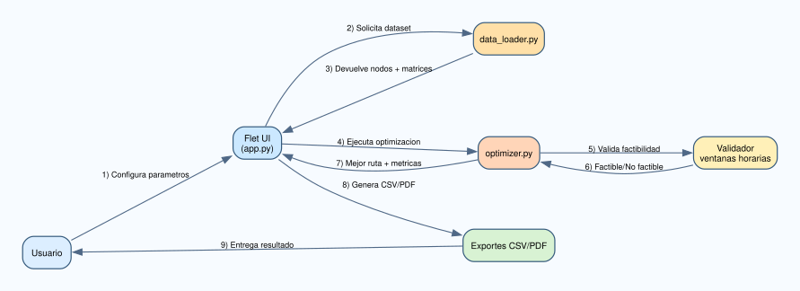

# 10 - UML y Casos de Uso

## Objetivo

Esta seccion agrega una vista UML formal del sistema para complementar DFD, arquitectura y DER.

## Diagrama de casos de uso

Actores:

- Usuario Operador (primario).
- Google APIs (secundario, para refresco de datos).

Diagrama: [diagrams/uml_use_case.svg](diagrams/uml_use_case.svg)

## Diagrama de clases de dominio

Muestra las entidades logicas centrales y sus relaciones:

- Depot.
- NodoTuristico.
- ConfiguracionRuta.
- ResultadoRuta.
- TramoRuta.
- MatricesViaje.

Diagrama: [diagrams/uml_class_domain.svg](diagrams/uml_class_domain.svg)

## Diagrama de secuencia (optimizacion)

Representa el intercambio principal desde la configuracion hasta la exportacion.

Diagrama: [diagrams/uml_sequence_optimizacion.svg](diagrams/uml_sequence_optimizacion.svg)

## Trazabilidad UML -> Implementacion

- Casos de uso CU-01..CU-05: [docs/software-engineering/02-Requerimientos-y-Casos-de-Uso.md](02-Requerimientos-y-Casos-de-Uso.md).
- Secuencia UI/datos/optimizador: [app.py](../../app.py), [src/data_loader.py](../../src/data_loader.py), [src/optimizer.py](../../src/optimizer.py).
- Clases de dominio: mapeadas en datasets, estructuras de resultado y tablas exportables.
